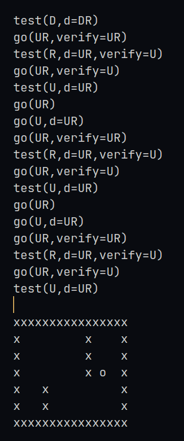

# turing_machine

Esse projeto é um simulador da máquina de Turing, configurado por um json. É possível o uso de uma fita simples e infinita ou uma fita bidimensional e infinita. A intenção desse repositório não é explicar o que é uma máquina de Turing, mas buscar simula-la de uma forma facilitada.

Este projeto é inspirado em: https://turingmachine.io/

## Como usar

Crie um ambiente virtual e baixe as dependências:
```shell
python -m venv .venv
./.venv/bin/python -m pip install -r requirements.txt
```
Depois disso, use como quiser a CLI para executar programas usando a máquina de Turing, os exemplos podem ajudar bastante no começo. Para executar um exemplo, use:

```shell
./.venv/bin/python ./cli.py ./examples/binary-addition.json 2 --delay .1
# ou
./.venv/bin/python ./cli.py ./examples/2d-ping-pong.json 1 --delay .1
```



### Configurando a máquina

#### `type`
O `type` define o tipo da máquina, podendo ser do tipo `2d` ou `tape`, e tam como valor padrão: `tape`. Por exemplo:

```json
{
    "start-state": "2d"
}
```

#### `states`
O `states` define a função de transição da máquina, ou seja, estabelece as regras para movimentação e edição da máquina. Deve ser definido para que a máquina inicie. Por exemplo, sabendo que `R` indica direita e `L` esquerda, temos:

```json
{
    "states": {
        "start": {
            " ": ["R", "verify_digit"]
        },
        "verify_digit": {
            "0123456789": ["L", "is_a_digit", " "],
            "*": ["L", "is_not_a_digit", " "]
        },
        "is_a_digit": {
            "*": ["L", "done"]
        },
        "is_not_a_digit": {
            "*": ["L", "done"]
        },
        "done": {}
    }
}
```

#### `start-state`
O `start-state` define o estado inicial da máquina, sendo definido antes no objeto `states`, é exigido para o funcionamento da máquina. Por exemplo:

```json
{
    "start-state": "start"
}
```

#### `inputs`
O `inputs` define as fitas de entrada para a máquina, é exigido no mínimo um.
Cada entrada deve ter uma fita inicial e a posição inicial do cabeçote da máquina, o valor padrão da posição inicial é a origem, `0` para as máquinas do tipo `tape`, e `[0,0]` para as máquinas do tipo `2d`.

Exemplo do tipo "tape":
```json
{
    "inputs": [
        {
            "tape": "1011+101",
            "position": 4
        }
    ]
}
```

Exemplo do tipo "2d":
```json
{
    "inputs": [
        {
            "tape": [
                "xxxxx",
                "x   x",
                "x   x",
                "xxxxx"
            ],
            "position": [1, 2]
        }
    ]
}
```

#### `blank-symbol`
O `blank-symbol` define o carácter vazio da fita, e tem como valor padrão: " "

```json
{
    "blank-symbol": " "
}
```

### `else-sign`
o `else-sign` funciona como um caracter que representa todos os outros não configurados.
Nos exemplos, como caracter padrão, foi usado o simbolo `*`. Definido pela seguinte forma:

```json
{
    // Caso seja definido, recomenda-se: "*"
    "else-sign": "*"
}
```
